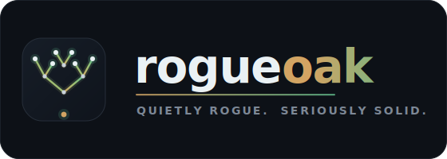

**Quietly rogue. Seriously solid.** We build sharp, well-crafted developer tools — and ship the good ones as open source.

---

## What we're building

**Spec-driven development with learning feedback loops — installable into any repo in three commands.**

AI-assisted development is fast but forgetful. Spectra makes intent explicit *before* you build and captures learning *after* — all in version control, all driven by your coding agent. It's packaged natively for **Claude Code, OpenAI Codex, Gemini CLI, and Cursor**, so any repo can adopt the whole protocol without copy-pasting a thing.

&nbsp;**[Explore Spectra →](https://github.com/rogueoak/spectra)**

---

## On the workbench

A few more products are taking shape — not ready to show yet, but built with the same care. Watch this space. 🌱

---

## Behind rogueoak

rogueoak is the studio of **Matthew Maynes** — a solo founder who likes hard problems, clean abstractions, and software that earns its keep. Every project here starts from one belief: good tools should be rigorous *and* a pleasure to use.

If that's your kind of thing, the work is the introduction — [browse the repos](https://github.com/rogueoak) or [say hello](https://www.linkedin.com/in/matthew-maynes/).
